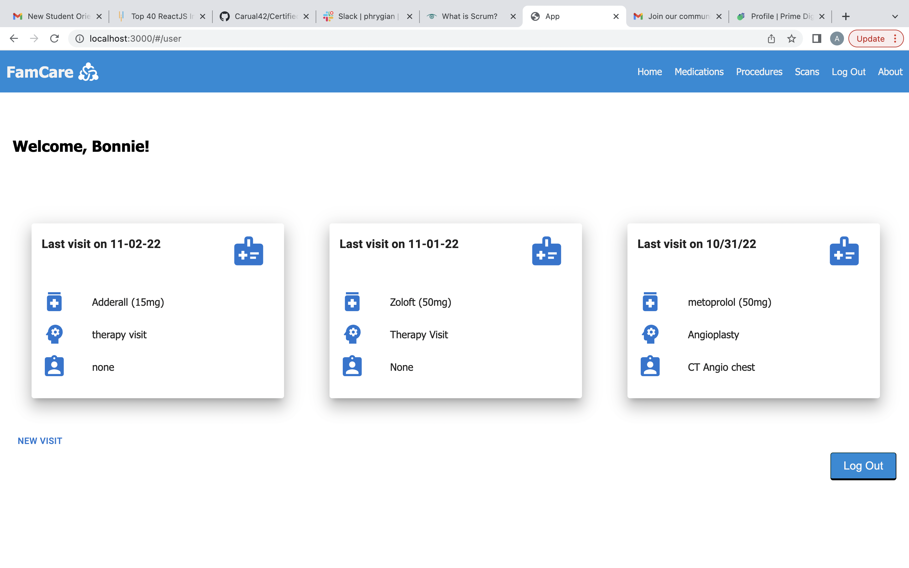
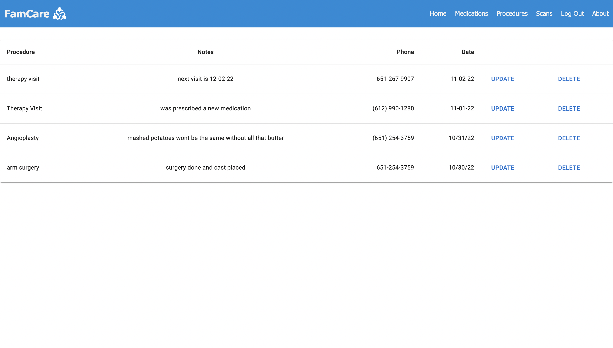
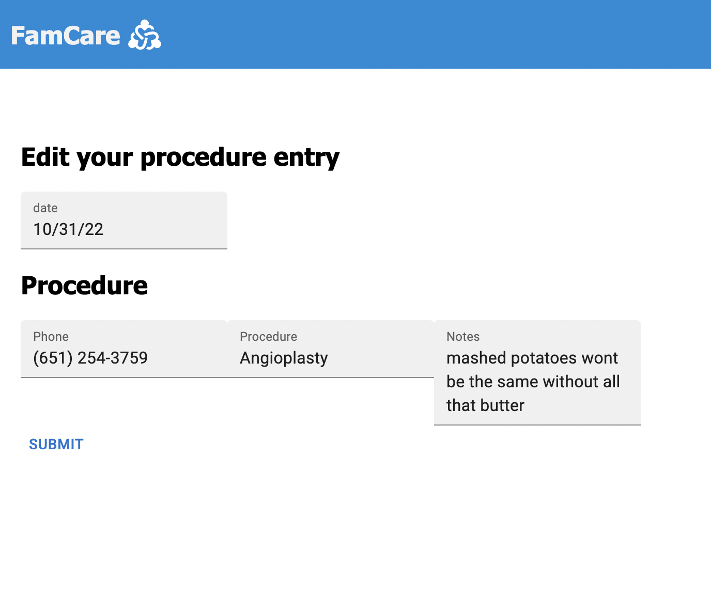

#  The support system for your support system

## Description

_Duration: 2.5 weeks, working part time_

I have seen many patients and their loved ones feel powerless in a seemingly hopeless situation. this app will give your support system, a support system. Using this app you can create medication lists, track scans and exams done, update your records if there's any change to the above, and delete any out-dated information.

## Screen Shots

  

### Prerequisites

- [Node.js](https://nodejs.org/en/)
- [nodemon](https://nodemon.io/)
- [PostgreSQL](https://www.postgresql.org/download/)

## Installation

1. Create a database named `famcare`.
2. The queries in the `database.sql` file are set up to create the necessary tables. The project is built on [PostgreSQL](https://www.postgresql.org/download/), so you will need to make sure to have that installed. I recommend using [Postico](https://eggerapps.at/postico/) to run those queries as that was used to create the queries.
3. Open up your editor of choice and run an `npm install`.
4. Run `npm run server` in your terminal.
5. Run `npm run client` in your terminal.
6. The `npm run client` command will open up a new browser tab for you! FamCare was built to be compatible with Google Chrome.

## Usage

Having a well documented medical history is key to good future healthcare. FamCare will help you keep track of all the bigger things like medications and surgeries, as well as the small things, like reference phone numbers and notes given by your provider. Making your healthcare visits easier.

## Built With

- [Node.js](https://nodejs.org/en/)
- [nodemon](https://nodemon.io/)
- [Express](https://expressjs.com/)
- [React](https://reactjs.org/)
- [PostgreSQL](https://www.postgresql.org/download/)
- [Material UI](https://mui.com/)
- [React Icons](https://www.npmjs.com/package/react-icons)
- JavaScript
- CSS
- HTML
- AWS (in progress)